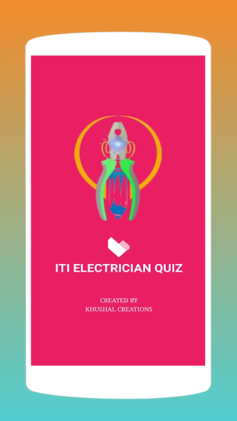
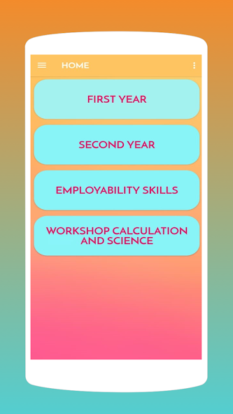
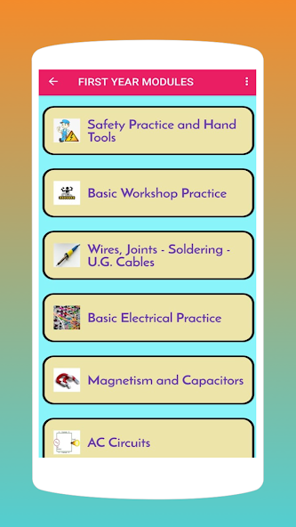
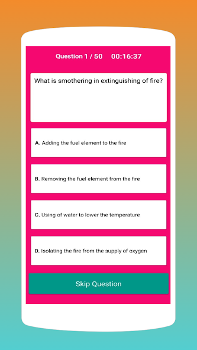
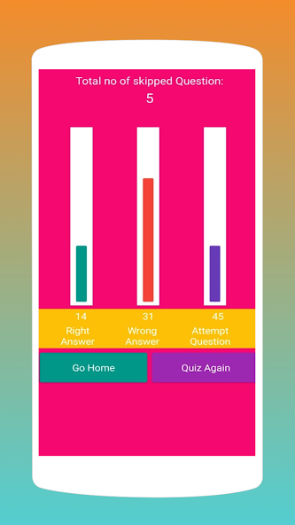

# ITI Electrician Quiz

An Android application for practicing **Multiple Choice Questions (MCQs)** designed for ITI students in the Electrician trade under NSQF Level 5 syllabus. This app helps learners prepare effectively for AITT/CBT exams by providing a large collection of questions in both online and offline modes.

---

## 📌 Features

* ✅ Quiz questions covering **Theory, Workshop Calculations, and Employability Skills**.
* 📚 **Practice Mode** with non-repeating questions for continuous learning.
* 🌐 **Online & Offline Support** – study anytime, anywhere.
* 📊 **Score Tracking** – view performance at the end of each quiz.
* 📱 **Lightweight App** that runs on most Android devices.
* 💡 Ad-supported for free usage.

---

## 🚀 Getting Started

### Prerequisites

* Android device (phone or tablet).
* Internet connection for online quiz mode (offline quizzes work without it).

### Installation

1. Download from Google Play Store: [ITI Electrician Quiz](https://play.google.com/store/apps/details?id=com.khushalcreations.itielectricianquizapp).
2. Open the app and choose a **subject/topic**.
3. Select **Practice** for untimed questions or **Quiz** mode for a challenge.

---

## 📷 Screenshots

Here are some screenshots of the app:

---

## ⚙️ Technologies Used

* **Android (Java/Kotlin)**
* **XML** for UI
* **SQLite/Local Storage** for offline mode
* **Google Play Services** for distribution

---

## 📩 Developer & Support

* 👨‍💻 Developer: **Hirchand Shivram Patil** (Khushal Creations)
* 📧 Email: **[hirchandpatil@gmail.com](mailto:hirchandpatil@gmail.com)**
* 🌍 Website: [khushalcreations2403.blogspot.com](https://khushalcreations2403.blogspot.com)

For queries or suggestions, feel free to reach out.

---

## 🤝 Contributing

Contributions are welcome!

1. Fork the repository.
2. Create a branch: `git checkout -b feature/my-feature`.
3. Commit changes: `git commit -m "Added new feature"`.
4. Push to branch: `git push origin feature/my-feature`.
5. Open a Pull Request.

---

## 📜 License

This project currently does not include a license. Add a license (MIT, Apache 2.0, etc.) before making it open-source.

---

## 📝 Changelog

* **Jul 09, 2021** – Latest Play Store update.
* **10+ Downloads** on Google Play Store.

---

✨ *This README is for the ITI Electrician Quiz project. Customize it further to match your GitHub repository structure (e.g., add build instructions, Gradle setup, or CI/CD workflow).*
